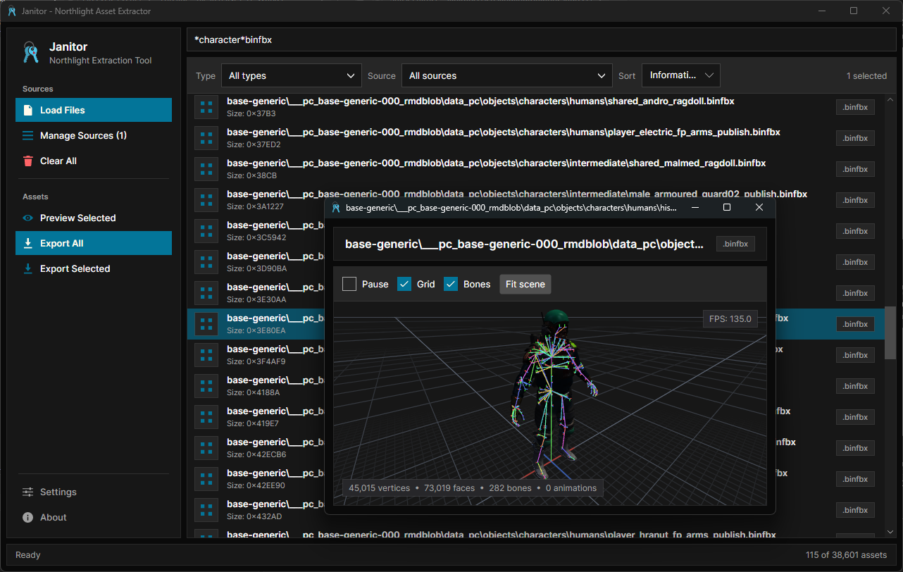
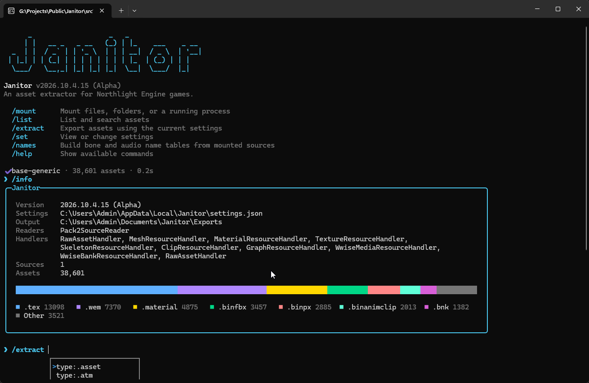

# Janitor

Janitor is an asset extractor for Northlight Engine Games. It provides a CLI and UI for exporting various assets including Animations, Models, Sounds, and more.

###  Janitor is currently in an alpha state, so expect bugs, crashes, and other issues. Please report anything you run into — bug reports, UX feedback, suggestions, and general improvements are all greatly appreciated! You can open logs folder via Settings, please include this and as much detail as you can when reporting issues!

## Supported Games and Content

Janitor recognizes common Northlight resources and converts the following:

| Asset Type | Quantum Break | Control | Alan Wake 2 | FBC: Firebreak | CONTROL Resonant | Formats / Notes |
|---|:---:|:---:|:---:|:---:|:---:|---|
| Models | ❌ | ❌ | ✅ | ✅ | ✅ | `.semodel`, `.cast`, `.fbx`, `.psk`, `.gltf`, `.ma`, `.md5`, `.obj`, `.smd`, `.xmodel_export`, `.xmodel_bin` |
| Animations | ❌ | ❌ | ✅ | ✅ | ✅ | `.seanim`, `.cast` |
| Textures | ❌ | ❌ | ✅ | ✅ | ✅ | `.dds`, `.jpg`, `.png`, `.tga`, `.bmp`, `.tiff` |
| Materials | ❌ | ❌ | 🟡 | 🟡 | 🟡 | Exports textures grouped by material. Settings and other info dumping is a WIP. |
| Audio | ❌ | ❌ | ✅ | ✅ | ✅ | `.wav`, `.flac` |

> **Note:** Additional formats supported by the backend may also work, but only the formats listed above are currently confirmed.

Janitor can also export any game file as raw bytes. Unsupported asset types fall back to raw export by default.

## Getting Started

Go to the [Releases](/../../releases) to find the latest release. At the moment Janitor is in Alpha.

Download the latest release ZIP, extract it, and run either:

- `Janitor.UI.exe` for the graphical interface
- `Janitor.CLI.exe` for the command-line interface

## Using the UI

Launch `Janitor.UI.exe` and select **Load Files** to load one or more Northlight `.rmdtoc` files.

Once loaded, Janitor displays the discovered assets in the main asset list. Each entry shows its **name**, **type**, and additional **information** where available.

The main actions are:

- **Load Files** — Load one or more `.rmdtoc` sources.
- **Preview Selected** — Preview supported asset types. Unsupported assets can still be inspected as raw bytes.
- **Export All** — Export all assets currently included by the active filters.
- **Export Selected** — Export the currently selected asset or assets.
- **Double-click an asset** — Quickly export that asset.
- **Manage Sources** — View loaded sources and unload individual sources.
- **Clear All** — Remove all loaded assets and unload all sources.
- **Settings** — Open Janitor's configuration options and options for logs/plugins.
- **About** — Display application and version information.

***Please note plugins are a heavy WIP and are not yet supported.***

The asset list can be filtered by **asset type** and **source**, and sorted by **name**, **information**, or **type**.

The search bar supports wildcard matching, making it easy to narrow large asset lists to specific names or patterns. For example: `*character*.binfbx`

The status bar at the bottom of the window displays the current asset count and the latest operation status.

## Using the CLI

Launch `Janitor.CLI.exe` to enter Janitor's interactive command-line interface.

Commands such as `/mount` and `/help` can be used to manage sources and discover available functionality.

## Disclaimer

Janitor is an unofficial community tool and is not affiliated with, endorsed by, or supported by Remedy Entertainment.

Janitor does not distribute game assets or game files. Users are responsible for ensuring that their use of extracted content complies with applicable licenses, terms of service, and copyright laws.

Game names, trademarks, and other intellectual property belong to their respective owners.

## Credits

Janitor is built on the following libraries and native binaries. Components authored by Scobalula (the Janitor author) are listed first, followed by third-party components.

**Scobalula libraries**

- [RedFox](https://github.com/Scobalula/RedFox) — asset processing, format conversion, graphics, imaging, compression, and related functionality
- [Cast.NET](https://github.com/Scobalula/Cast.NET) and [CallOfFile](https://github.com/Scobalula/CallOfFile) — animation and format support

**Third-party libraries**

- **UI framework** — [Avalonia](https://github.com/AvaloniaUI/Avalonia), [SkiaSharp](https://github.com/mono/SkiaSharp) (with [Skia](https://skia.org/)), [HarfBuzzSharp](https://github.com/mono/SkiaSharp) (with [HarfBuzz](https://harfbuzz.github.io/)), [ANGLE](https://github.com/google/angle), [CommunityToolkit.Mvvm](https://github.com/CommunityToolkit/dotnet)
- **Graphics and windowing** — [Silk.NET](https://github.com/dotnet/Silk.NET), [GLFW](https://www.glfw.org/), [OpenAL Soft](https://github.com/kcat/openal-soft)
- **CLI** — [Spectre.Console](https://github.com/spectreconsole/spectre.console), [PrettyPrompt](https://github.com/waf/PrettyPrompt), [TextCopy](https://github.com/CopyText/TextCopy), [Model Context Protocol C# SDK](https://github.com/modelcontextprotocol/csharp-sdk)
- **Audio and compression** — [Opus](https://github.com/xiph/opus), [FLAC](https://github.com/xiph/flac), [libvorbis](https://github.com/xiph/vorbis) (with [libogg](https://github.com/xiph/ogg)), [LZ4](https://github.com/lz4/lz4), [Zstandard](https://github.com/facebook/zstd), [miniz](https://github.com/richgel999/miniz), [K4os.Compression.LZ4](https://github.com/MiloszKrajewski/K4os.Compression.LZ4)

Full attribution, copyright notices, and license texts for every component are provided in [THIRD-PARTY-NOTICES.md](THIRD-PARTY-NOTICES.md) and the [`third_party/licenses/`](third_party/licenses) directory.

I've done my best to audit the use of amazing libraries that make this work possible. If you feel a package you made was used and was not attributed, please raise an issue.